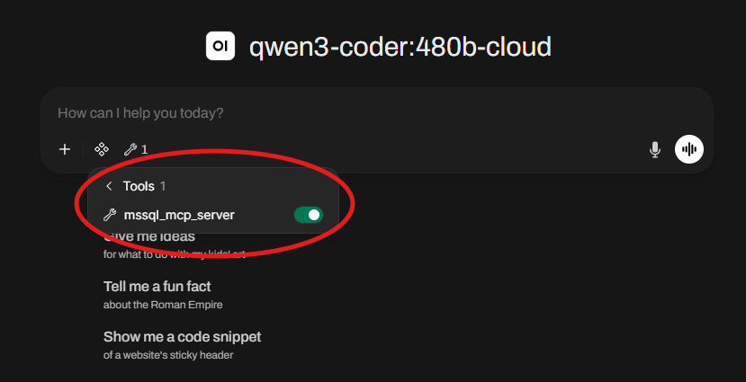

# Analysis

This folder includes all interactivity with the database hosted on Azure.
Primarily the analysis agent implementation using Ollama and SQL MCP Server
via Docker.

Since the database is hosted on the cloud, there is no implementation or interface
within this repository, but instead by VSCode `SQL Server (mssql)` extension.
The `docker-compose.yaml` file contains several services that host the different software
needed for the analysis agent.

## Ollama + OpenWebUI Service

Credit to https://www.bitdoze.com/ollama-docker-install/ for providing the boilerplate for
the Docker containers running Ollama and OpenWebUI.

### Setup

Ollama can run on either the CPU or GPU (NVIDIA). Although AMD GPY is supported, it is not within
the scope of this project. Instructions for that are provided in the credited article. In order to run the local LLM and chat UI on either CPU or GPU, open Docker Desktop then run either of the following commands in a terminal:

```
docker compose --profile cpu up
# OR
docker compose --profile nvidia up
```

Once the container is fully running, open up OpenWebUI through http://localhost:3000 in order to access the Ollama models.

Once logged in, there won't initially be any models loaded, so you must load them manually. Navigate to `Profile > Admin Panel > Settings > Models > Manage` and visit Ollama's page to see
downloadable models. The video shows where to how to navigate. __Make sure to download a model that can use MCP tools__. You can also download a Ollama cloud model for better compute and AI intelligence.

<video src="../docs/media/ollama-model.mp4" width="640" controls></video>

### Running the Models

With a model selected, you must now enable the MCP tool for the LLM to use.



In the case that the Docker environment setup failed for OpenWebUI, manually add the tool through `Profile > Admin Panel > Settings > Integrations > Manage Tool Servers` with the URL being the access point for the MCP server [http://mcp_server:8000](http://mcp_server:8000) and the password used for the MCP server (`top-secret`).

With weaker models, it is common for them to hallucinate in several ways, such as ignorance to their access to the MCP tool, fake output, etc. Be very explicit with what you want as much as possible.

### Teardown

Docker commands work across various shells. In order to completely clean up the Docker containers, run the following shell commands.

```
docker network disconnect --force analysis_app-net ollama
docker network disconnect --force analysis_app-net openwebui
docker rm -f ollama openwebui
docker compose down
```

## [mssql_mcp_server](/mssql_mcp_server) Service

Credit to https://github.com/RichardHan/mssql_mcp_server# for providing the source code for this software.

The `/mssql_mcp_server` folder contains Python files for managing the SQL MCP Server module, which
is used by our `docker-compose.yaml` and `Dockerfile` to containerize it.

## Up Next

Here are some features that can be worked on in the future:

### OpenWebUI System Prompt Environment Variable

System prompts guide the personality of the LLM, similar to agentic context files as it prepends the prompt to every model. An example:
```
"You are a database analyst with read access to an Azure SQL database called plane-db containing two tables: learning_data and hyperparameters. Use the execute_sql tool for all data retrieval — never fabricate table names, columns, or data. Report raw query results faithfully. If a query fails, read the error and try again. If you haven''t queried it, you don''t know it."
```
OpenWebUI does not directly support this feature as of right now, at least obviously. It is possible to set environment variables through the Docker compose file, but it is still not confirmed as to whether a system prompt is supported or not. This [OpenWebUI issue](https://github.com/open-webui/open-webui/discussions/3794) provides potential documentation that would be useful.

__A means to automate system prompts for all models via environment variables is needed.__

### OpenWebUI Automated MCP Tool Enable

Similar to [OpenWebUI System Prompt Environment Variable](#openwebui-system-prompt-environment-variable), an environment variable could be used to automate tool enabling. The integration of the MCP tool is already automated, and default model parameters might be available for automating the enabling of the integrated tool.

__Automated tool enabling via default model parameters is needed.__

### Claude Code + Codex Support Documentation

Documentation could be added to outline the steps to plug in more advance agentic AI, such as Claude Code or Codex. It has been proven by experiment that Claude Code works with the current toolchain, as it can interact with the MCP server directly through stdin, bypassing the need for MCP-to-OpenAPI tool. Claude Code needs only to interact with the exposed [http://mcp_server:8000](http://mcp_server:8000) port.

__Testing is needed for Codex and other agentic AI, and official documentation for Claude Code is needed.__