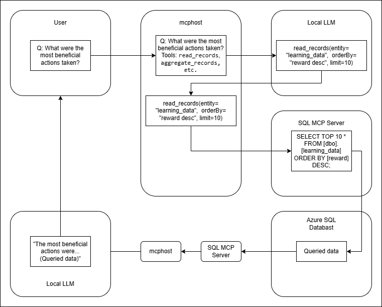

# Analysis Agent

## Pipeline

The following image descibes the architecture of how the analysis agent is implemented.

The pipeline is as follows:
1. The user sends a question to the mcphost.
2. Before the LLM receives the question, the mcphost appends the available tools for the LLM to use.
3. With the question and available tools, the LLM will build a JSON containing the tools it wants to use as well as what information it wants to query for. 
4. The mcphost passes that information to the SQL MCP Server which will convert that into literal SQL code and query the database.
5. The database will respond with the queried information and the information is passed back through the modules back to the LLM.
6. The LLM will format the answer to be more conversational and then send it back to the user.

If using Claude Code, Codex, or other agentic AI that has access to its own suite of MCP tools, only the SQL MCP Server would be needed.