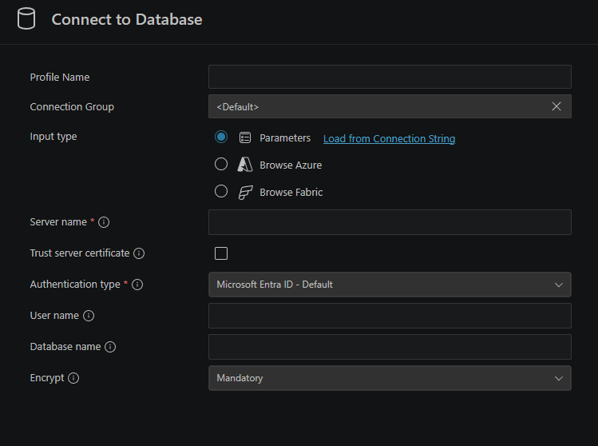

# Database

## Overview

The SQL database is hosted through Microsoft Azure's free SQL database plan. In order to access the
database, it would be recommended to use VSCode's `SQL Server (mssql)` extension. To be able to
access, permissions must also be granted by the GitHub owner `breponte`.

## Setup

The database is hosted on Microsoft Azure. In order to interact with the SQL database you must
download the VSCode extension `SQL Server (mssql)` for Windows and Linux, maxOS requires a homebrew
installation. Detailed setup instructions can be found [here](https://learn.microsoft.com/en-us/azure/azure-sql/database/connect-query-vscode?view=azuresql).

As mentioned in the the [instructions](https://learn.microsoft.com/en-us/azure/azure-sql/database/connect-query-vscode?view=azuresql),
open a new file and set its language to SQL in order to be able to establish a connection. Open the
command palette and search for `MS SQL:Connect` and __Create Connection Profile__. The following hud should display:

Fill it out as follows:

| Field | Input |
|---|---|
| Profile Name | *(optional)* A friendly label like `rl-plane` |
| Connection Group | `<Default>` (leave as-is unless you want to organize into a folder) |
| Input type | `Parameters` (already selected — correct choice) |
| Server name* | `yourservername.database.windows.net` (from Azure Portal → SQL Server → Overview, ___ask GitHub owner for this field___) |
| Trust server certificate | ☐ **Unchecked** (Azure SQL has valid certificates — do not check this) |
| Authentication type | `Microsoft Entra ID - Default` (it's more secure) |
| User name* | Server admin's name (___ask GitHub owner for this field___) |
| Database name | `plane-db` (this is the name of the database this project uses) |
| Encrypt | `Mandatory` (already selected — correct choice, required for Azure SQL) |

\* ___ask GitHub owner for this field___

## Tables

### `learning_data`

| Column        | Type                 | Nullable | Default                | Notes                    |
| ------------- | -------------------- | -------- | ---------------------- | ------------------------ |
| `event_id`    | `BIGINT UNSIGNED`    | NO       | —                      | Primary key, auto-increment |
| `run_id`      | `INT UNSIGNED`       | NO       | —                      | Indexed                  |
| `episode_id`  | `INT UNSIGNED`       | NO       | —                      | Indexed                  |
| `step`        | `INT UNSIGNED`       | NO       | —                      | Indexed                  |
| `state`       | `JSON`               | YES      | `NULL`                 | Must be valid JSON if set |
| `action`      | `TINYINT UNSIGNED`   | NO       | —                      | Pitch, roll, yaw, thrust |
| `reward`      | `DOUBLE`             | NO       | —                      |                          |
| `recorded_at` | `DATETIME(6)`        | NO       | `CURRENT_TIMESTAMP(6)` | Microsecond precision; indexed |

**Indexes**

| Name                                 | Type    | Columns                          |
| ------------------------------------ | ------- | -------------------------------- |
| `PRIMARY`                            | Primary | `event_id`                       |
| `idx_learning_data_run_episode_step` | Index   | `run_id`, `episode_id`, `step`   |
| `idx_learning_data_run_recorded`     | Index   | `run_id`, `recorded_at`          |

**Constraints**

| Name                            | Type  | Definition                              |
| ------------------------------- | ----- | --------------------------------------- |
| `chk_learning_data_state_json`  | Check | `state IS NULL OR JSON_VALID(state)`    |

**Table options:** `ENGINE=InnoDB`, `CHARSET=utf8mb4`, `COLLATE=utf8mb4_unicode_ci`

---

### `hyperparameters`

| Column          | Type              | Nullable | Default                | Notes                       |
| --------------- | ----------------- | -------- | ---------------------- | --------------------------- |
| `hp_id`         | `BIGINT UNSIGNED` | NO       | —                      | Primary key, auto-increment |
| `run_id`        | `INT UNSIGNED`    | NO       | —                      | Part of unique key          |
| `algorithm`     | `VARCHAR(128)`    | NO       | —                      | Reinforcement learning algorithm used |
| `learning_rate` | `DOUBLE`          | NO       | —                      |                             |
| `gamma`         | `DOUBLE`          | NO       | —                      |                             |
| `epsilon`       | `DOUBLE`          | NO       | —                      |                             |
| `seed`          | `BIGINT UNSIGNED` | NO       | —                      |                             |
| `recorded_at`   | `DATETIME(6)`     | NO       | `CURRENT_TIMESTAMP(6)` | Microsecond precision; part of unique key |

**Indexes**

| Name                                 | Type    | Columns                   |
| ------------------------------------ | ------- | ------------------------- |
| `PRIMARY`                            | Primary | `hp_id`                   |
| `uq_hyperparameters_run_recorded`    | Unique  | `run_id`, `recorded_at`   |

**Table options:** `ENGINE=InnoDB`, `CHARSET=utf8mb4`, `COLLATE=utf8mb4_unicode_ci`
